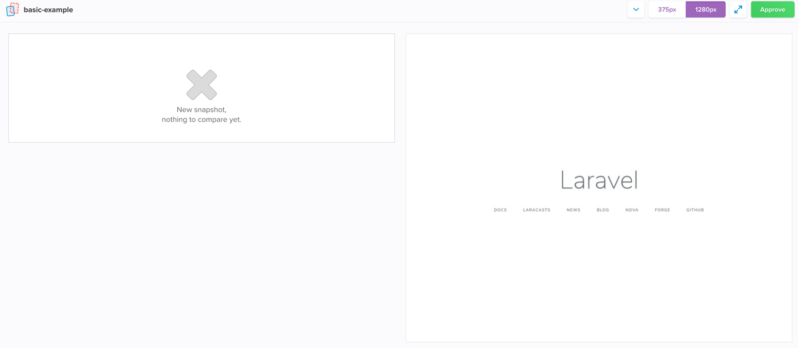
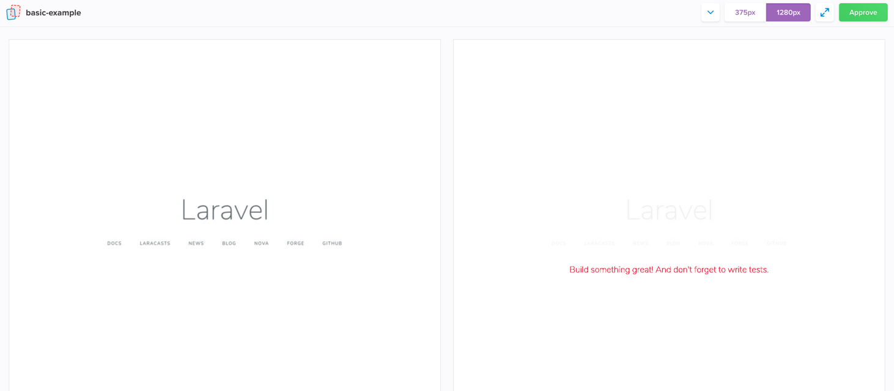

# Visual UI screenshot testing for Laravel Dusk
[](https://packagist.org/packages/stechstudio/laravel-visual-testing)
[](https://travis-ci.org/stechstudio/laravel-visual-testing)
[](https://scrutinizer-ci.com/g/stechstudio/laravel-visual-testing)
[](LICENSE.md)
[](https://packagist.org/packages/stechstudio/laravel-visual-testing)

This package extends Dusk with the ability to do visual diffs with the [Percy visual testing](https://percy.io/) platform.

### Why write visual tests?

If you are new to the idea of visual testing we recommend reading through [Visual testing and visual diffs](https://blog.percy.io/product-spotlight-series-visual-testing-and-visual-diffs-6a1fc540fc93) on the Percy blog.

> Sometimes called visual regression testing or UI testing, visual testing is the process of automatically discovering and reviewing software for perceptual changes.
> 
> **Visual testing is all about what your users actually see and interact with.**

This form of testing is very useful in cases where you want to guard against unexpected changed to your UI. Visual testing is not meant to replace your Laravel unit/feature/browser tests, but rather provide another tool in your testing toolbox.

## Getting started

This package integrates with [Laravel Dusk](https://laravel.com/docs/master/dusk). If you haven't already, first go through the Dusk [installation steps](https://laravel.com/docs/master/dusk#installation) and make sure you can run the example test with `php artisan dusk`.

Next:

1. Sign up for a free account at [percy.io](https://percy.io) and create your first project. Put your `PERCY_TOKEN` in your Laravel .env file (or [specific dusk environment files](https://laravel.com/docs/5.7/dusk#environment-handling) if you are using those).

    ```
    PERCY_TOKEN=aaabbbcccdddeeefff
    ```

2. Install the [`@percy/agent`](https://www.npmjs.com/package/@percy/agent) NPM package.

    ```
    npm install --save-dev @percy/agent
    ```
    
3. Install this composer package.

    ```
    composer require stechstudio/laravel-visual-testing --dev
    ```

## How to use

To take a snapshot call `snapshot()` on the browser instance in any of your Dusk tests. 

```php
$browser->visit('/auth/login')
        ->snapshot();
```

Then run your test suite like your normally would.
 
```
php artisan dusk
```

### Naming your snapshots

By default the name of your snapshot will be the relative URL of the page (e.g. `/auth/login`). You can also pass in your own name when taking the snapshot.

```php
$browser->visit('/auth/login')
        ->snapshot('Login page');
```

### Snapshot options

You can pass in an array of options when taking a snapshot:

- `widths`: An array of integers representing the browser widths at which you want to take snapshots.
- `minHeight`: An integer specifying the minimum height of the resulting snapshot, in pixels. Defaults to 1024px.

```php
$browser->visit('/auth/login')
        ->snapshot('Login page', [ widths: [768, 992, 1200] ]);
```

### Disabling snapshots

If you want to run your tests without snapshots, use the `--without-percy` command line option.

### Selecting base build branch

Percy uses a variety of strategies to determine the optimal base build for comparison. For details see [Base build selection](https://docs.percy.io/docs/baseline-picking-logic).

If you want to override and specify your own base you have two options:

- `--percy-target-branch` : Specify base by branch name
- `--percy-target-commit` : Specify by target commit SHA (only works if there is a finished Percy build for that commit)

## Basic example

Open the example test at `tests/Browser/ExampleTest.php`. Add a call to `snapshot()` right after the `visit`, and pass in a name for your snapshot.

```php
public function testBasicExample()
{
    $this->browse(function (Browser $browser) {
        $browser->visit('/')
            ->snapshot('basic-example') // <-- add this
            ->assertSee('Laravel');
                
    });
}
```

Now go run your test:

```
php artisan dusk
```

If all goes well, you should see output similar to this:

```
$ php artisan dusk
[percy] created build #1
[percy] percy has started.

[percy] snapshot taken: 'basic-example'
.                                                                   1 / 1 (100%)

Time: 2.37 seconds, Memory: 22.00MB

OK (1 test, 1 assertion)
[percy] stopping percy...
[percy] waiting for 1 snapshots to complete...
[percy] done.
[percy] finalized build #1
```

Now go check out your Percy dashboard, and you should see the new build. 



At this point it won't have anything to compare the snapshot to. But if you go modify the `welcome.blade.php` file and run it again, you'll get a nice visual diff of your change.


